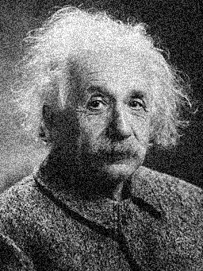
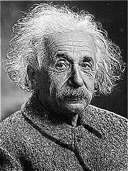
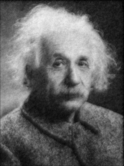
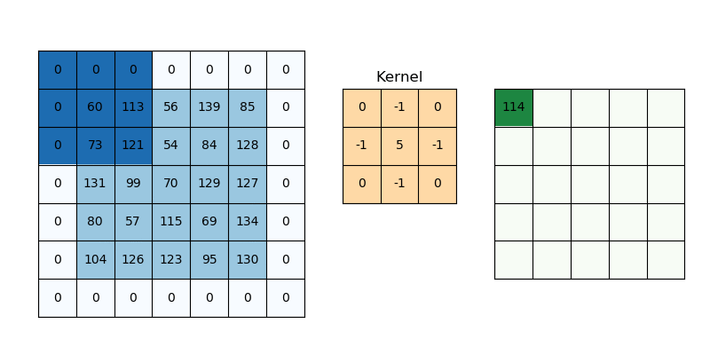

# NLA Challenge 1 (Group 6)

Hands-on Challenge 1 of the course _Numerical Linear Algebra_ by Professor Antonietti, Polimi, a.y. 2024/25.

## 1. Execution Results

- To run the main code `Challenge1.cpp` on terminal:

  ```bash
  g++ -I ${mkEigenInc} Challenge1.cpp -o exec
  ./exec einstein.jpg > output.txt
  ```

- **This is the output file: [output.txt](output.txt)**

- To run the lis related commands on terminal (take one processor as example):

  ```bash
  ./test1 A2.mtx w.mtx x.mtx solve_x_hist.txt
  -i gmres -maxiter 1000 -tol 1.0e-9 -p ilu -ilu 2
  > outputLis.txt
  ```

- And this is the lis command output file: [outputLis.txt](outputLis.txt)

---

### 1.1 Full Output Results

The output results with details are shown in files below:

- For the Challenge.cpp output: [output.txt](output.txt)

- For the lis command output: [outputLis.txt](outputLis.txt)

### 1.2 Image Results

---

| Noised Image                            | Smoothed Noise Image                              | Sharpened Image                               |
| --------------------------------------- | ------------------------------------------- | --------------------------------------------- |
|  |  |  |

| Edgedetected Image                                   | VectorX Image                         | VectorY Image                         |
| ---------------------------------------------------- | ------------------------------------- | ------------------------------------- |
|  |  |  |

## 2. Explanation

- Use 256 pixel image _einstein.jpg_ as input, print related matrix manually for checking, and output the generated image.

- **all the matrices are by rowmajor order and normalized to $[0,1]$ when processing.** And convert to `Matrix<unsigned char>` when output.

- **Attention! All the output vectors are stored by this format below:**

  ```
  %%MatrixMarket vector coordinate real general
  nonzeros (like: 87296)
  index value (like: 1 0.123; index based from 1 instead of 0)
  ```

  **the most important thing is that the index is based from 1 instead of 0.** Because the LIS `test1.h` file's default input vector file format is like this, take `testvec0.mtx` for example:

  ```
  %%MatrixMarket vector coordinate real general
  100
  1  2.00000000000000000000e+000
  2  1.00000000000000000000e+000
  3  1.00000000000000000000e+000
  4  1.00000000000000000000e+000
  5  1.00000000000000000000e+000
  6  1.00000000000000000000e+000
  7  1.00000000000000000000e+000
  8  1.00000000000000000000e+000
  9  1.00000000000000000000e+000
  ```

- v.mtx represents $v$; w.mtx represents $w$; x.mtx represents $x$; y.mtx represents $y$. _A1.mtx, A2.mtx, A3.mtx_ are repectively the $H_{av2}$, $H_{sh2}$ and $H_{lap}$ related convolution matrices.

- There are some values which are greater than 1 or less than 0 at the kernel $mn*mn$ matrix such as `A2`, which may cause the final processed image vector has some out of bounds values. So we check the range of image data before `stbi_write_png()` at the `outputVectorImage()` function.

- For solving equation of $(I + A_3) \times y = w$:

  - **We use conjugate gradient method to solve it with preconditioner `IncompleteCholesky`.** Because we can find that is matrix $A_3+I$ is symmetric and positive definite, so using this kind of solver and preconditioner is very suitable.
  - By using above method we get this output reslut: **The iteration count for solving y is: 15; The final residual is: 2.76738e-11**

- For solving $A_2 \times x = w$:

  - **We use GMRES method to solve it with preconditioner `ILU` by lis.** Because we can find that is matrix $A_2$ is not symmetric and positive definite.
  - By using above method at lis we get: **GMRES: number of iterations = 24; GMRES: relative residual = 6.901486e-10**

- There are some common functions for convenience

  - `convolutionMatrix()`: Input a specific kernel and do related convolution operation to the data, return the sparse matrix of dimension $(mn,mn)$ which is generated from `tripletList` and has the same function as the convolution procedure .
  - `convolutionMatrix2()`: An alternative way to realize this function.
  - `void outputImage()`: Define the function that convert a **vector** to a `height`\*`width` rectangle matrix. Finally converts to `Matrix<unsigned char>` type and output it to _image.png_ by `stbi_write_png()` method.
  - `exportVector()`: export a vector to a mtx file. **Please pay attention here if we use `saveMarketVector()`, then when using LIS reading, some issues may occur (at least for me)**.
  - `exportSparsematrix():` export a sparse matrix to a mtx file by using `saveMarket()` method.
  - `isSymmetric():` check if a matrix is symmetric by comparing the transpose of it and see the norm of the difference of the two matrix. If the norm is less than the tolerance, we can say that the matrix is symmetric.
  - `isPositiveDefinite()`: check if a matrix is positive definite by do `cholesky()` (searched online). So, if this operation succeed, it means positive definite. And if it's also symmetric, then the conjungate gradient solver can be used.

- To ensure $A$'s size is correctly $(mn,mn)$, we use zero padding here. So, the pixel $A(0,0)=60$ is transformed into $A_{\text{new}}=60*5-73-113=114$.
  
