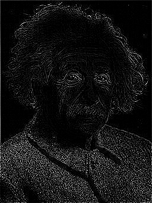
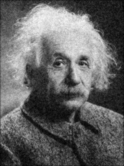

# NLA Challenge 1 (Group 6)

Hands-on Challenge 1 of the course _Numerical Linear Algebra_ by Professor Antonietti, Polimi, a.y. 2024/25.

The description of the challenge is [here](Challenge1_description.pdf). We really thank the teachers for the opportunity.

## 1. Execution Results

- To run the main code `Challenge1.cpp` on terminal using the Eigen library:

  ```bash
  g++ -I ${mkEigenInc} Challenge1.cpp -o exec
  ./exec einstein.jpg > output.txt
  ```

- To solve the linear system $A_2 \mathbf{x}=\mathbf{w}$ on terminal using Lis (Library of Iterative Solvers for linear systems):

  ```bash
  mpicc -DUSE_MPI -I${mkLisInc} -L${mkLisLib} -llis test1.c -o test1
  mpirun -n 4 ./test1 A2.mtx w.mtx x.mtx solve_x_hist.txt -i gmres -maxiter 1000 -tol 1.0e-9 -p ilu -ilu 2 > outputLis.txt
  ```

  If you don't want to use mpi for mutiple processors and _include the `lis.h` file_, simply use:

  ```bash
  ./test1 A2.mtx w.mtx x.mtx solve_x_hist.txt -i gmres -maxiter 1000 -tol 1.0e-9 -p ilu -ilu 2 > outputLis.txt
  ```

- To solve the linear system $(A_3 + I) \mathbf{y}=\mathbf{w}$ on terminal using Lis (just for double checking, should be same as the result by using Eigen):

  ```bash
  ./test1 A3_plus_I.mtx w.mtx y_check.mtx solve_y_hist.txt -i cg -maxiter 1000 -tol 1.0e-10 > outputLis2.txt
  ```

---

### 1.1 Full Output Results

The output results with details are shown in files below:

- For the `Challenge.cpp` output: **[output.txt](output.txt)**

- For the Lis command output: **[outputLis.txt](outputLis.txt)** and **[outputLis2.txt](outputLis2.txt)**

### 1.2 Image Results

---

| Noised Image                            | Smoothed Noise Image                              | Sharpened Image                               |
| --------------------------------------- | ------------------------------------------------- | --------------------------------------------- |
|  |  |  |

| Edgedetected Image                                   | VectorX Image                         | VectorY Image                         |
| ---------------------------------------------------- | ------------------------------------- | ------------------------------------- |
|  |  |  |

## 2. Explanation

- All the matrices are by RowMajor order and normalized to $[0,1]$ while processing. Indeed, there are some values which are greater than 1 or less than 0 at the kernel $(mn,mn)$ matrix such as `A2`, which may cause some out of bounds values in the final processed image vector. So, we check the range of image data before `stbi_write_png()` in the `outputVectorImage()` function.

- **Attention!** All the output vectors are stored by this format below:

  ```
  %%MatrixMarket vector coordinate real general
  nonzeros
  index(from 1) value
  ```

  For example, take the vector `testvec0.mtx` in the Lis library:

  ```
  %%MatrixMarket vector coordinate real general
  100
  1  2.00000000000000000000e+000
  2  1.00000000000000000000e+000
  3  1.00000000000000000000e+000
  4  1.00000000000000000000e+000
  5  1.00000000000000000000e+000
  6  1.00000000000000000000e+000
  7  1.00000000000000000000e+000
  8  1.00000000000000000000e+000
  9  1.00000000000000000000e+000
  ...
  ```

  **The most important thing is that the first index is 1 instead of 0**, which is the Lis `test1.h` file's default input vector file format, which is different from the Eigen's one.

- `v.mtx` represents $\mathbf v$; `w.mtx` represents $\mathbf w$; `x.mtx` represents $\mathbf x$; `y.mtx` represents $\mathbf y$.

- `A1.mtx`, `A2.mtx`, `A3.mtx` are repectively the $H_{av2}$, $H_{sh2}$ and $H_{lap}$ related convolution matrices.

- **For solving equation of $(I + A_3) \mathbf y = \mathbf w$:**

  - **We use Conjugate Gradient (CG) method to solve it with preconditioner `IncompleteCholesky`.** Since the matrix $A_3+I$ is symmetric and positive definite and, moreover, diagonally dominant, this kind of solver and preconditioner are very suitable.
  - **For preconditioning: The Incomplete Cholesky (IC) is likely the best choice** due to its effectiveness in handling SPD matrices with strong diagonal dominance (ours are 5 for diagonal elements, -4 otherwise). The default way of Diagonal (Jacobi) Preconditioner is less effective in this case, even though it's simpler and with a lower computational cost.
  - The Incomplete Cholesky provides a good balance between efficiency and memory usage and significantly improves the convergence of the CG solver compared to the diagonal preconditioner.
  - By using above-mentioned method directly in Eigen we get these results:
    <p align="center"> <strong> CG with IC preconditioning: number of iterations = 15; relative residual = 2.76738e-11. </strong> </p>    
    Instead, the plain(diagonal precondition) CG results are:
    <p align="center"> CG: number of iterations = 32; relative residual = 7.36466e-11. </p>
    In addiction, the result from Lis (just for double checking) is:
    <p align="center"> CG: number of iterations = 33; relative residual = 7.364660e-11. </p>

- **For solving $A_2 \mathbf x = \mathbf w$:**

  - **We use GMRES method to solve it with preconditioner `ILU` by Lis**, because matrix $A_2$ is not symmetric.
  - By using above-mentioned method at Lis we get:
    <p align="center"> GMRES: number of iterations = 24; relative residual = 6.901486e-10. </p>

- These are some helper functions for convenience:

  - `convolutionMatrix()`: Input a specific kernel and do related convolution operation to the data, return the sparse matrix of dimension $(mn,mn)$ which is generated from `tripletList` and has the same function as the convolution procedure .
  - `convolutionMatrix2()`: An alternative way to realize this function.
  - `void outputVectorImage()`: Define the function that converts a **vector** to a $(mn,mn)$ rectangle matrix with `Matrix<unsigned char>` type and outputs it to _image.png_ by `stbi_write_png()` method.
  - `exportVector()`: export a vector to a mtx file (index is from 1). **Please pay attention here if we use `saveMarketVector()`, then when using Lis reading, some issues may occur**.
  - `exportSparsematrix():` export a sparse matrix to a mtx file by using `saveMarket()` method.
  - `isSymmetric():` check if a matrix is symmetric by comparing the transpose of it and see the norm of the difference of the two matrix. If the norm is less than the tolerance, we can say that the matrix is symmetric.
  - `isPositiveDefinite()`: check if a matrix is positive definite by checking if a Cholesky factorization can be succesfully performed. Moreover, if the matrix is also symmetric then the conjungate gradient solver in the Eigen library can be used.

- To ensure that the size of an image in matrix form is correct, i.e. $(mn,mn)$, we use zero padding here. It means that the pixel $A(0,0)=60$ is transformed into $A_{\text{new}}(0,0)=60\cdot5-73-113=114$.
  

---

## 3. Additional Checks

Finally, for double checking the rightness of our resuls, we performed two additional checks: one for the system $A_2 \mathbf{x} = \mathbf{w}$ and one for $(A_3 + I) \mathbf{y}=\mathbf{w}$. As expected, we obtained the following images:

- Noised Image and CheckW (coming from $A_2 \mathbf{x}$) should be same;
- VectorY from Eigen and CheckY from Lis should be same.

| Noised Image                            | Check (_w_check_)                                 |
| --------------------------------------- | ------------------------------------------------- |
|  |  |

| VectorY Image                        | Check (_y_check_)                                 |
| ------------------------------------ | ------------------------------------------------- |
|  |  |

- What more, it's not hard to find that our matrix $A_3 + I$ is actually same as the **mn\*mn** matrix coming from the sharpening convolution operator $H_{sh1}$ which is:
  \[
  H\_{sh1} = \begin{pmatrix}
  0 & -1 & 0 \\
  -1 & 5 & -1 \\
  0 & -1 & 0
  \end{pmatrix}
  \]
  actually we have succeeded to check this by norm of the difference of the two matrix as below in our `cpp code`:

  ```cpp
  Matrix<double, kernel_size, kernel_size, RowMajor> hsh1;
  hsh1 << 0.0, -1.0, 0.0,
        -1.0, 5.0, -1.0,
        0.0, -1.0, 0.0;
  SparseMatrix<double, RowMajor> A_sh1 = convolutionMatrix(hsh1, height, width);
  std::cout << "Norm of (A_sh1 - A3_Plus_I) is:" << (A3_Plus_I - A_sh1).norm() << std::endl;
  ```

  the output is as below (also in output.txt file):

  ```bash
  Norm of (A_sh1 - A3_Plus_I) is: 0
  ```

  So we can give the conclusion that the `output_noised.png` image is coming from the `output_vectorY.png` image by using the sharpening operator $H_{sh1}$.
